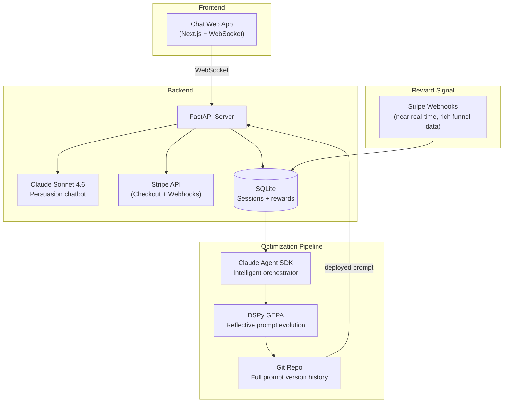

# Design: Charity Persuasion Chatbot with Autonomous Prompt Evolution

> **Draft — personal idea doc. Not reviewed.**

---

## Overview

A web app where a chatbot persuades visitors to donate to charity. The chatbot generates unique Stripe payment links per session (cards, Apple Pay, Google Pay, bank transfers, stablecoins). When the chat ends, Stripe webhooks confirm whether a donation was received. This signal — along with engagement proxies from the Stripe checkout funnel — feeds into a DSPy GEPA optimization pipeline that rewrites the chatbot's persuasion prompts. Each optimization run commits artifacts to a git repo. Over time the system autonomously discovers what conversational strategies actually convert.

The core thesis: **reinforcement learning for prompt optimization**. The prompt is the policy, the action space is what the chatbot says, and the reward is the donation signal. No human labeling. No manual prompt engineering. Just a sparse reward signal and a reflective evolutionary loop.

---

## The RL Framing

This is the intellectual core. We map the problem onto an RL framework, then solve it with DSPy's GEPA optimizer instead of traditional RL methods (which fail on sparse rewards).

| RL Concept | Maps To |
|------------|---------|
| **State** | Conversation history at any point |
| **Action** | Chatbot's next message (LLM output) |
| **Policy** | The system prompt (what we optimize) |
| **Reward** | Donation signal: binary + amount + funnel events |
| **Episode** | One complete chat session, greeting to disconnect |

Why not actual RL (GRPO, PPO)? The GEPA paper (ICLR 2026, Oral) demonstrates that reflective prompt evolution outperforms RL by 6-20% while using 35x fewer rollouts. With sparse binary rewards, RL policy gradients are essentially noise. GEPA sidesteps this by reflecting on execution traces in natural language rather than computing gradients from scalars.

---

## Architecture



---

## Components

### 1. Chat Web App

A clean, anonymous chat interface. User lands on a page, conversation begins. The chatbot's goal is to convince the user to donate. At some point it presents a payment link.

**Stack**: Next.js frontend, WebSocket via Socket.IO. Session ID generated on page load (cookie or URL param). No login required.

**Session lifecycle**: Starts on page load. Each message pair (user + bot) is stored. Ends when WebSocket disconnects (tab close, navigation, goodbye). On disconnect, session is marked "completed" and queued for reward checking.

### 2. Payment Layer (Stripe)

Stripe handles all payments — cards, Apple Pay, Google Pay, bank transfers, plus stablecoins (USDC, USDP, USDG). This maximizes the potential donor pool, which directly maximizes signal density for the optimizer.

**Integration**: Stripe Checkout Sessions, generated per chat session via the API. Stripe handles the entire checkout flow, payment processing, and receipts.

```python
import stripe

def create_donation_link(session_id: str, charity_name: str) -> str:
    checkout = stripe.checkout.Session.create(
        mode="payment",
        line_items=[{
            "price_data": {
                "currency": "usd",
                "product_data": {"name": f"Donation to {charity_name}"},
                "unit_amount": 500,  # $5 default
            },
            "quantity": 1,
            "adjustable_quantity": {"enabled": True, "minimum": 1, "maximum": 100},
        }],
        metadata={"chat_session_id": session_id},
        success_url="https://app.example.com/thanks",
        cancel_url="https://app.example.com/chat",
    )
    return checkout.url
```

**Webhook reward signal**: Listen for `checkout.session.completed` and `payment_intent.succeeded`. Near-real-time. Session metadata maps donations back to chat sessions trivially.

**Critical advantage**: Stripe gives us **intermediate funnel events** — clicked link, started checkout, entered payment details, completed payment. Each step is a richer signal than binary donated/didn't. This funnel data is arguably more valuable for the optimizer than the binary donation outcome itself.

### 3. Reward Signal

Stripe webhooks fire in near-real-time. No polling, no confirmation windows, no timing ambiguity. The webhook payload includes the `chat_session_id` metadata, so attribution is trivial.

#### Session Record

```json
{
  "session_id": "abc-123",
  "messages": [{"role": "bot", "content": "..."}, {"role": "user", "content": "..."}],
  "prompt_version": "v0.3.2",

  "funnel": {
    "payment_link_shown": true,
    "clicked_payment_link": true,
    "started_checkout": true,
    "completed_payment": true
  },
  "donated": true,
  "donation_amount_usd": 10.00,
  "message_count": 14,
  "asked_about_charity": true,
  "disconnected_at": "2026-03-13T14:22:00Z",
  "reward_resolved_at": "2026-03-13T14:23:12Z"
}
```

### 4. The Persuasion Chatbot

Powered by Claude Sonnet 4.6. The system prompt — the thing that evolves — controls conversational tone, persuasion tactics (social proof, urgency, emotional appeal, logical argument, reciprocity), timing of the donation ask, objection handling, aggression level, and narrative arc.

The system prompt has one section:
1. **Evolvable instructions** (DSPy optimizes): Everything else — strategy, tone, timing, framing.

**Initial prompt**: Hand-written seed. Reasonable but not heavily optimized. The whole point is autonomous optimization.

### 5. DSPy Optimization Pipeline

#### DSPy Module

```python
import dspy

class PersuasionChatbot(dspy.Module):
    def __init__(self):
        self.persuade = dspy.ChainOfThought(
            "conversation_history, user_message -> bot_response"
        )

    def forward(self, conversation_history, user_message):
        return self.persuade(
            conversation_history=conversation_history,
            user_message=user_message
        )
```

#### GEPA: Primary Optimizer

GEPA (Reflective Prompt Evolution, ICLR 2026 Oral) is the primary optimizer. It was explicitly designed for sparse reward problems.

**Why GEPA over alternatives**:

| Optimizer | Approach | Sparse Signal Handling | Sample Efficiency |
|-----------|----------|----------------------|-------------------|
| COPRO | Coordinate ascent | Poor — needs clear metric gradient | Moderate |
| MIPROv2 | Bayesian optimization | Moderate — DSPy docs recommend BootstrapFewShot for sparse labels | Good |
| **GEPA** | **Reflective evolution + Pareto frontier** | **Excellent — designed for this** | **35x fewer rollouts than RL** |

**How GEPA works**:
1. **Sample trajectories**: Run current prompt against accumulated sessions. Collect full conversation traces.
2. **Reflect in natural language**: LLM reads traces and diagnoses failures — "the bot asked for money too early", "the user's skepticism wasn't addressed", "the emotional appeal was too aggressive."
3. **Propose prompt mutations**: Generate candidate variants addressing diagnosed issues.
4. **Evaluate on Pareto frontier**: Test candidates, keep those that improve on any dimension without regressing. Combine complementary improvements.

The key insight: GEPA can learn from a conversation that *almost* led to a donation (user engaged for 20 turns, asked about the charity, left at payment step) even though the binary signal is identical to a 1-message bounce. MIPROv2's Bayesian surrogate can't — it only sees the scalar.

**Performance**: Outperforms GRPO by 6-20%, outperforms MIPROv2 by 10%+, uses up to 35x fewer rollouts.

#### Composite Metric

```python
def composite_metric(example, prediction, trace=None):
    score = 0.0

    # Primary: donation
    if example.donated:
        score += 10.0
        score += min(example.donation_amount_usd / 50, 5.0)

    # Stripe funnel (not available with raw crypto)
    if example.clicked_payment_link:
        score += 2.0
    if example.started_checkout:
        score += 3.0

    # Engagement proxies
    score += min(example.message_count / 20, 1.0)
    if example.asked_about_charity:
        score += 1.0

    return score
```

The funnel events from Stripe are crucial. They give the optimizer gradient between "no engagement" and "almost donated" — a spectrum that raw binary 0/1 can't provide.

**Why no secondary optimizer (e.g. SIMBA)?** SIMBA was considered for few-shot demo selection but dropped. It needs positive examples to select from — useless until dozens of donations accumulate. GEPA's trace reflections already capture what makes conversations work, making a second optimizer redundant complexity. If few-shot demos prove valuable later (Phase 4+), SIMBA can be revisited.

#### The Sparse Signal Problem

Even with Stripe maximizing payment accessibility, if donation rate is ~1-5%, signal is still sparse. Mitigations:

**Batching**: Accumulate 200-500 sessions before running optimization. Don't optimize per-session.

**Immediate trigger on donations**: When a donation occurs (rare, high-signal), trigger an optimization run immediately. Don't wait for the batch to fill.

**Donation amount as continuous reward**: $50 donation > $1 donation. Stripe gives exact USD amounts directly.

**Engagement proxies**: Conversation length, charity questions, sentiment. Weighted lower than actual donations to prevent gaming.

**Negative example mining**: "I'm not interested" is more informative than a 1-message bounce. Weight examples by informativeness.

**Cross-session learning**: Compare prompt version A (avg 5 turns) vs version B (avg 12 turns). Even without donations, GEPA can reflect on why one version engages better.

#### Optimization Cadence

1. **Accumulate** sessions into a buffer
2. **Trigger** when buffer reaches N sessions (start with 200) OR a donation event occurs
3. **Run GEPA** on full traces with composite metric
4. **Evaluate** candidate prompt against validation holdout
5. **Deploy** if improved; **commit** either way

### 6. Claude Agent SDK Orchestrator

The Agent SDK is the intelligent outer loop. Not a cron job — it reasons about optimization results.

**Why an agent, not a script?** The agent reads GEPA's reflections, compares metric distributions, judges statistical significance, writes commit messages explaining what changed and why, and adjusts hyperparameters for the next run. It's an intelligent decision-maker over the optimization loop.

### 7. Git as Prompt Version Control

Every optimization run produces a commit, regardless of outcome.

```
prompts/
  current.json              # live prompt
  history/
    v0.1.0.json
    v0.2.0.json
runs/
  2026-03-13T14-00/
    config.json              # optimizer hyperparams
    training_data.jsonl      # session summaries
    metrics.json             # before/after composite scores
    gepa_reflections.md      # GEPA's natural-language analysis
    candidate_prompt.json    # what the optimizer produced
    decision.md              # agent's deploy/skip reasoning
```

The `gepa_reflections.md` files are themselves a research artifact — an LLM's evolving theory of persuasion, grounded in real user behavior.

---

## Tech Stack

| Component | Library/Service |
|-----------|----------------|
| **Frontend** | Next.js, React, Tailwind, Socket.IO client |
| **Backend** | FastAPI (Python), uvicorn, Socket.IO server |
| **Chatbot LLM** | Anthropic SDK — Claude Sonnet 4.6 |
| **Optimizer LLM** | Anthropic SDK — Claude Opus 4.6 |
| **Optimizer** | DSPy GEPA |
| **Orchestration** | Claude Agent SDK |
| **Payments** | Stripe (Checkout Sessions + Webhooks) |
| **Database** | SQLite, SQLAlchemy, aiosqlite |
| **Caching** | Redis |
| **Git automation** | GitPython |
| **Deployment** | Docker, docker-compose |

---

## Implementation Phases

### Phase 0: MVP Chat + Stripe ✅

Static hand-written prompt. Stripe Checkout integration. Basic Next.js chat UI. SQLite session storage. Stripe webhooks for donation tracking. Goal: conversations happening, donations possible, data accumulating.

### Phase 1: Reward Pipeline + Data Collection ✅

Build the full session record pipeline. Funnel event tracking (link shown → clicked → checkout started → completed). Composite metric implementation. Still static prompt — just accumulating training data.

### Phase 2: GEPA Integration ✅

DSPy module. GEPA optimizer wired up. First optimization pass (likely on engagement proxies + funnel events, since donations will be rare early). Claude Agent SDK orchestrator. Git commit pipeline. Deploy/rollback logic.

### Phase 3: Monitoring + A/B Testing ✅

Monitoring dashboard (donation rate, funnel conversion, prompt version performance). A/B testing framework for prompt variants. Analyze GEPA reflections for early patterns.

### Phase 4: Autonomous Evolution ✅

Let it run. Monitor prompt evolution over weeks/months. Analyze GEPA reflections for emergent persuasion strategies. Track donation rate trajectory across prompt versions. Write up findings.

---

## Risks & Open Questions

### Signal Sparsity (Biggest Risk)

Even with Stripe, if donation rate is 1%, you need 100 sessions per positive example. GEPA's trace reflection helps — it learns from near-misses, not just outcomes — but it's untested on multi-turn conversation optimization at this scale. The engagement proxies and funnel events are our main mitigation.

### GEPA on Conversations (Untested Territory)

GEPA was benchmarked on math (AIME) and coding tasks where traces are single reasoning chains. Our traces are multi-turn conversations — structurally different. Open questions: how much of each conversation trace to include in GEPA's reflection window, whether to reflect per-turn or per-conversation, and how to structure Pareto frontier dimensions.

### Optimizer Gaming

GEPA + composite metric might find degenerate solutions — e.g., extremely long conversations that score high on engagement proxies without being persuasive. The donation signal must dominate the metric weighting (10.0 for donation vs 1.0 for engagement). Monitor for this.

### Cold Start

No data at launch. The seed prompt must be good enough to have conversations at all. Options: strong manual seed prompt, synthetic conversation bootstrapping, heavy reliance on engagement proxies in early optimization passes.

---

## Implementation Notes

- Private GitHub repo: `josephfinlayson/donate`
- Deploy to DigitalOcean via Terraform. Configs in `infra/`. **Using SQLite** — simpler, cheaper, sufficient for this scale. Redis runs as Docker container on the droplet.
- Local setup → `docker compose`
- Production → DigitalOcean droplet at `donate.innocentspark.com`
- Stripe → sandbox mode currently. Need to configure production webhooks at `https://donate.innocentspark.com/webhook/stripe`
- CI/CD: Not yet set up. Options: GitHub Actions workflow that SSHs into droplet and runs `deploy.sh`, or webhook-triggered deploy.
- Test GEPA optimizations by having simulated conversations with the bot using Chrome plugin. Try adversarial personas to bootstrap the optimized prompt.

### Questions (Resolved)

- **Domain setup**: `donate.innocentspark.com` → A record pointing to `146.190.198.204`. Caddy auto-provisions HTTPS via Let's Encrypt. ✅
- **DigitalOcean managed Redis deprecated**: Running Redis as Docker container instead. ✅
- **Switched from managed Postgres to SQLite**: Simpler, cheaper, sufficient. ✅

### Remaining TODO

- [ ] CI/CD: GitHub Actions to auto-deploy on push to main
- [ ] Stripe webhooks: Configure production endpoint URL
- [ ] Simulated conversations for GEPA testing via Chrome plugin
- [ ] Switch Stripe to live keys for real donations
